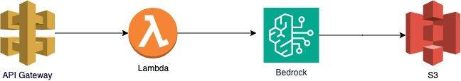

# AWS Bedrock API

This project provides an example of how to call Bedrock FM's 3rd party APIs from AWS. Bedrock FM is a powerful tool for leveraging the capabilities of generative AI models.

**IMPORTANT - make sure to request model access on AWS Bedrock before calling the API.**



## Getting Started
Follow these steps to build, deploy, and destroy the AWS infrastructure for this project.

### Build
To build the project, run the following command:
`npm run build`

### Deploy
To deploy the project to AWS, use the AWS Cloud Development Kit (CDK). First, navigate to the project directory and run the following command:
`cdk deploy`

### Destroy
If you need to tear down the AWS resources created by this project, use the following command:
`cdk destroy`

### Usage
This project demonstrates how to call Bedrock FM's 3rd party APIs from AWS. You can customize the APIs and integrate them into your own applications as needed.

`/chat`
```
curl --location '{API_ENDPOINT}/chat' \
--header 'Content-Type: text/plain' \
--data '{
    "key": "python",
    "message": "implement binary search tree recursively"
}'
```

`/image`
```
curl --location '{API_ENDPOINT}/image' \
--header 'Content-Type: text/plain' \
--data '{
    "message": "generate image of DOG and CAT driving a car"
}'
```